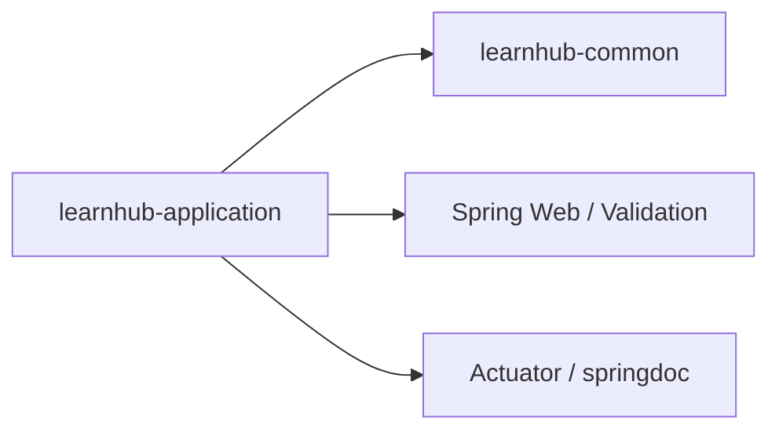
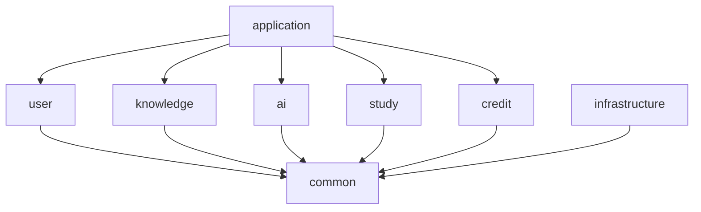

# Day 7：从“能运行”到“能交付”——模块架构、README、完整验收与答辩

## 0. 今天到底要学会什么

前六天写出了工程骨架。今天不急着加新功能，而是证明：代码能从干净环境重复构建、文档与真实工程一致、模块没有乱依赖，并且你能解释设计。

完成后，你应该能够：

1. 理解模块化单体与微服务的基本区别。
2. 解释八个 Maven 模块的职责。
3. 分清构建包含关系、编译依赖关系、Spring 运行扫描关系。
4. 识别循环依赖和错误依赖方向。
5. 编写足以让其他开发者启动项目的 README。
6. 从 clean 状态构建、测试、启动并验证应用。
7. 整理一个有排查过程的 Bug 记录。
8. 完成第一周口头答辩，决定是否进入第二周。

预计时间：6～8 小时。

---

## 1. 什么是模块化单体

### 1.1 单体不等于“一坨代码”

单体表示主要作为一个应用进程部署。模块化表示代码内部仍有清晰边界。

LearnHub 当前：

```text
一个 Spring Boot 进程
一个可执行应用 JAR
多个 Maven 业务/技术模块
```

这些模块在编译时是不同 JAR，但启动时由 `learnhub-application` 组合到一个进程。

### 1.2 为什么现在不做微服务

微服务会新增：

- 多个部署单元。
- 服务发现与配置分发。
- 网络调用失败。
- 分布式事务和最终一致性。
- 多服务日志和链路追踪。
- 更多 CI/CD、监控和资源成本。

你目前首先要学会一个请求、一个事务、一个模块边界怎样正确实现。模块化单体保留边界，同时减少分布式复杂度。

### 1.3 以后还能拆吗

可以。真正适合拆出的候选通常是：

- 文档解析 Worker：资源消耗与 API 不同，适合独立伸缩。
- AI 调用服务：超时、限流、成本与普通 CRUD 不同。

但只有单体中的边界清楚、接口稳定、测试齐全，拆分才是移动边界，而不是重新救火。

---

## 2. 八个模块逐个解释

### `learnhub-application`

职责：

- `main` 启动类。
- 组合当前需要运行的业务模块。
- Web 全局边界配置。
- 环境配置文件。

不应长期包含：用户注册、文档状态转换、额度扣减等业务规则。

可以把它理解为乐队指挥和舞台入口，不是每种乐器本身。

### `learnhub-common`

职责：

- 稳定的统一响应。
- 错误码契约。
- 通用业务异常。
- 真正被多个模块使用且语义稳定的类型。

风险：最容易变成“大杂烩”。如果一个工具只有 knowledge 使用，就应该留在 knowledge，而不是因为名字听起来通用就放 common。

### `learnhub-user`

未来负责：注册、登录、Token、角色、权限、账号状态和审计。

它不应直接处理文档解析或额度订单规则。

### `learnhub-knowledge`

未来负责：知识库、文档元数据、文件所有权、文档状态和解析任务发起。

它可以定义“需要保存文件”的业务需求，但具体 MinIO 客户端属于技术适配。

### `learnhub-ai`

未来负责：切分、Embedding、向量检索、Prompt、模型调用、流式回答和引用。

它不应该成为所有业务都随意调用的万能“AI 工具包”。

### `learnhub-study`

未来负责：题目、答题、判分、错题本、复习计划和学习统计。

它可能使用 AI 提供的能力，但自己的学习规则仍属于 study。

### `learnhub-credit`

未来负责：额度余额、流水、订单、并发扣减和回调幂等。

金额与额度规则不能散落在 AI Controller 中。

### `learnhub-infrastructure`

未来负责：MySQL、Redis、RabbitMQ、MinIO、Qdrant 等外部系统的客户端和技术实现。

它不承载“用户剩余一次额度时能否提问”这样的业务决定。

---

## 3. 三种容易混淆的“关系”

### 3.1 Reactor 构建包含关系

根 POM：

```xml
<modules>...</modules>
```

决定从根构建时有哪些子项目参与。这不代表模块之间互相依赖。

### 3.2 Maven 编译依赖关系

子模块：

```xml
<dependencies>...</dependencies>
```

决定一个模块编译和运行时能访问哪些其他模块/JAR。

如果 A 依赖 B：

```text
A -> B
```

Maven 会先构建 B，再构建 A。

### 3.3 Spring 运行时扫描关系

Maven 让类进入运行类路径后，Spring 还要根据 package 和注解发现 Bean。

所以一个 Controller 生效至少需要：

1. 所在模块进入 application 运行依赖。
2. 类 package 位于扫描范围。
3. 类有 `@RestController` 等组件注解，或通过配置注册。

这三个条件缺一个，都可能表现为接口不存在或 Bean 无法注入。

---

## 4. 依赖方向与循环依赖

### 4.1 什么是依赖方向

如果 application POM 声明 common：

```text
application -> common
```

表示 application 可以 import common 的公开类型。反方向不自动成立。

### 4.2 什么是循环依赖

```text
user -> knowledge
knowledge -> user
```

这形成环。Maven Reactor 无法决定先构建谁，设计上也说明两个模块边界纠缠。

解决循环不能只是把类全部搬进 common。应该分析：

- 是否存在一个应由上层协调的用例。
- 是否应通过小接口依赖。
- 是否划分错了业务边界。

### 4.3 第一周的真实依赖图

Day 1 瘦身后，启动骨架应非常简单：



其他业务模块仍在根 Reactor 中构建，但尚未被运行应用组合。这是“按需要接入”，不是模块丢失。

### 4.4 项目后期的计划关系

计划可能逐步演变为：



业务模块与 infrastructure 的最终依赖方式会在实现 Repository/外部客户端时再决定。当前不要为了画满箭头提前引入依赖。

---

## 5. 用 Maven 检查真实依赖

### 5.1 查看启动模块完整树

```powershell
cd D:\LearnHub\LearnHubBackend
mvn -pl learnhub-application dependency:tree
```

在输出中确认：

- 有 `learnhub-common`。
- 有 Spring Web、Validation、Actuator、springdoc。
- 没有 Security、MyBatis、RabbitMQ、Spring AI、Qdrant 等未来运行依赖。

### 5.2 分组检查

```powershell
mvn -pl learnhub-application dependency:tree "-Dincludes=org.springframework.security"
mvn -pl learnhub-application dependency:tree "-Dincludes=org.springframework.ai"
mvn -pl learnhub-application dependency:tree "-Dincludes=org.mybatis"
```

没有匹配输出是本周期望。

### 5.3 查看 Reactor 构建顺序

```powershell
mvn validate
```

或在完整构建的 Reactor Summary 中观察顺序。被依赖模块通常先于依赖方。

把当前真实关系画进 README，不要直接复制计划图而不验证。

---

## 6. 把 README 写成真正的启动说明

README 不是宣传口号，也不是把技术名词堆一页。它需要让没参与开发的人回答：项目是什么、需要什么、怎样启动、怎样验证、遇到什么限制。

可以按下面完整模板编写并替换占位内容：

````markdown
# LearnHub

LearnHub 是一个 AI 驱动的个人知识库与学习平台。用户将能够上传学习资料、构建向量知识库、基于资料问答并管理练习与复习计划。

当前项目处于第一阶段，采用 Maven 多模块的模块化单体架构。

## 当前进度

- [x] Java 21 / Spring Boot 3.5 工程骨架
- [x] 健康检查
- [x] 统一响应与异常处理
- [x] 示例接口、Validation、测试与 OpenAPI
- [x] 本地 Docker Compose 基础设施
- [ ] 用户注册、登录与权限
- [ ] 知识库和文件管理
- [ ] 异步解析与 RAG

## 技术栈

- Java 21
- Spring Boot 3.5.16
- Maven
- JUnit 5 / Mockito
- Docker Compose
- MySQL 8、Redis 7、RabbitMQ 4、MinIO、Qdrant

## 环境要求

- JDK 21
- Maven 3.9+
- Docker Desktop / Docker Compose

检查：

```powershell
java -version
mvn -version
docker version
docker compose version
```

## 构建

```powershell
cd D:\LearnHub\LearnHubBackend
mvn clean verify
```

## 启动基础设施

```powershell
Copy-Item .env.example .env
# 修改 .env 中的本地密码
docker compose config
docker compose up -d
docker compose ps
```

停止并保留数据：

```powershell
docker compose down
```

## 启动后端

```powershell
mvn -pl learnhub-application -am package
java -jar .\learnhub-application\target\learnhub-application-0.0.1-SNAPSHOT.jar --spring.profiles.active=dev
```

## 验证地址

- Health：`http://localhost:8080/actuator/health`
- Swagger UI：`http://localhost:8080/swagger-ui/index.html`
- OpenAPI JSON：`http://localhost:8080/v3/api-docs`
- RabbitMQ：`http://localhost:15672`
- MinIO：`http://localhost:9001`
- Qdrant：`http://localhost:6333/dashboard`

## 模块职责

（在这里加入八个模块说明和真实依赖图。）

## 学习与开发计划

参见 `LEARNHUB_PLAN.md` 和 `docs/week-01/`。

## 配置安全

真实 `.env`、密码和 API Key 不得提交。请从 `.env.example` 创建本地配置。
````

注意：README 中不应该写你的真实 Windows 密码、RabbitMQ 密码或未来模型 API Key。

---

## 7. 创建第一周复盘文档

创建：

```text
docs/learning/week-01-retrospective.md
```

使用模板：

```markdown
# 第一周复盘

## 1. 本周完成

用自己的话描述，不要只复制任务标题。

## 2. 我真正学会的概念

- Maven：
- Spring Boot：
- HTTP/MVC：
- Java：
- 测试：
- Docker：

## 3. 一个值得讲的 Bug

- 现象：
- 我最初以为：
- 我检查了：
- 真正根因：
- 修复方式：
- 下次怎样更快定位：

## 4. 仍不清楚的问题

写具体问题，不写“Spring 不太懂”。

## 5. 第二周计划

用户表、注册、登录、密码哈希、Security 与 JWT。
```

你之前的 `SpringBootApplication` 无法解析就是一个很好的 Bug 候选：现象是 IDE 无法解析注解，根因要根据当时真实情况记录为启动模块缺少实际依赖或 Maven 模型未刷新，不能凭结果编造。

---

## 8. 从干净状态进行最终验收

“我的 IDE 现在能跑”不够。我们要模拟一名开发者拿到仓库后的过程。

### 8.1 检查 Git

```powershell
git status --short
```

检查：

- 没有 `.env`。
- 没有 `target`。
- 没有 `.idea`。
- 没有临时 `request.json`、日志或密码文件。

如果有未提交的有效改动，先审查：

```powershell
git diff
git diff --staged
```

不要看到文件就盲目 `git add .`。

### 8.2 停止正在运行的旧应用

确保没有旧 Java 进程占用 8080。之前启动应用的终端按 Ctrl+C。

### 8.3 完整 Maven 验证

```powershell
mvn clean verify
```

记录：

- Reactor 是否全部 SUCCESS。
- Tests run、Failures、Errors。
- 最终 BUILD SUCCESS。

### 8.4 启动可执行 JAR

```powershell
java -jar .\learnhub-application\target\learnhub-application-0.0.1-SNAPSHOT.jar --spring.profiles.active=dev
```

记录 Profile、端口和 Started 三项日志。

### 8.5 验证 HTTP

另开 PowerShell：

```powershell
curl.exe -i http://localhost:8080/actuator/health
curl.exe -i -X POST "http://localhost:8080/api/v1/demo/greetings" -H "Content-Type: application/json" -d '{"name":"LearnHub"}'
curl.exe -i -X POST "http://localhost:8080/api/v1/demo/greetings" -H "Content-Type: application/json" -d '{"name":""}'
curl.exe -i -X POST "http://localhost:8080/api/v1/demo/greetings" -H "Content-Type: application/json" -d '{"name":"forbidden"}'
```

预期依次为：200、200、400、422。

### 8.6 验证文档

浏览器打开 Swagger UI，并确认请求字段、示例和接口描述正确。

### 8.7 验证 Docker

```powershell
docker compose up -d
docker compose ps
```

再次执行 Day 6 的五项服务检查。不要因为它们本周没被业务调用就跳过环境验收。

---

## 9. 主动故障考核

随机完成三个，并写清排查过程。

### A. 空 name

说明请求在哪个阶段失败、为什么 Service 没执行、哪个 Advice 方法处理。

### B. 非法 JSON

说明为什么它不是 `MethodArgumentNotValidException`，而是消息读取异常。

### C. 8080 端口冲突

启动两个应用，找到日志中的 Description/Action，使用环境变量让第二个运行在 8081，最后恢复。

### D. 移除 `@Service`

临时移除注解，观察应用启动失败，指出构造器需要的 Bean 为什么不存在，然后恢复并测试。

### E. 停止 Redis

通过 `docker compose ps` 与 logs 判断状态，再恢复并得到 PONG。

### F. 错误的 Controller 路径

临时改变 `@PostMapping`，观察测试如何以 404 失败，再恢复。

所有临时破坏都必须恢复，最后重新 `mvn clean verify`。

---

## 10. 更新核心计划

打开：

```text
D:\LearnHub\LEARNHUB_PLAN.md
```

只勾选真实通过验收的项目。比如应用能启动但测试还没写，就不能把“示例接口包含测试”勾上。

在“决策与问题记录”追加真正发生的重要决定，例如：

```text
第一周暂不把未来业务模块组合进 application，避免未使用 Starter 触发自动配置；到对应功能周按需加入。
```

记录原因和未来何时验证，不只写“改了 POM”。

---

## 11. Git 提交整理

查看近期历史：

```powershell
git log --oneline --decorate -10
```

本周理想上能看到类似：

```text
docs: complete week one guide and retrospective
chore: add local infrastructure with Docker Compose
test: cover demo API success and error responses
feat: add validated demo endpoint and global error handling
feat(common): add API response and business error model
feat: bootstrap application with actuator health check
chore: establish Maven project baseline
```

不要求文字完全相同，但每个提交应表达一个完整意图。不要为了凑数量把一个无法构建的中间状态提交，也不要把一周所有内容压成 `update` 一个提交。

最终：

```powershell
git status
```

应显示工作区干净。

---

## 12. 第一周答辩：先脱离文档回答

每题建议按四段结构：

```text
它是什么
解决什么问题
LearnHub 怎么使用
可能引入什么问题或限制
```

题目：

1. 为什么先选择模块化单体？
2. Maven 父 POM、聚合模块、子模块分别是什么？
3. dependencyManagement 和 dependencies 有什么区别？
4. 为什么启动模块不能提前引入所有 Starter？
5. `@SpringBootApplication` 的核心作用是什么？
6. Bean 和 Spring 容器是什么关系？
7. 一次 POST JSON 请求怎样到达 Service 并返回 JSON？
8. 参数错误、业务错误、未知系统错误如何区分？
9. HTTP 状态码和业务 code 为什么都需要？
10. `ApiResponse<T>` 的泛型解决什么问题？
11. 为什么使用全局异常处理器？
12. 单元测试、Web 切片测试、集成测试如何选择？
13. MockMvc 是否经过真实网络？
14. Docker 容器删除后数据为什么还能存在？
15. 如果应用启动失败，你如何系统排查？

---

## 13. 答辩参考要点

1. 模块化单体以一个进程部署，降低早期分布式复杂度，同时用模块保留业务边界；限制是边界需靠依赖和评审维护。
2. 父 POM提供继承配置；聚合模块用 `<modules>` 组织一次 Reactor 构建；子模块产生具体制品并声明自己的依赖。一个根 POM可以同时扮演父与聚合器。
3. dependencyManagement 管版本，不自动加入类路径；dependencies 真正引入直接依赖，且可能带来传递依赖。
4. Starter 可能触发自动配置，提前加入会让尚未使用的数据库、安全或 AI 配置影响启动，增加耦合和排错变量。
5. 它提供 Boot 配置入口、自动配置和组件扫描。
6. 容器负责创建、保存和连接对象；被容器管理的对象叫 Bean。
7. Tomcat 接收 HTTP，DispatcherServlet 匹配 Controller，Jackson 反序列化 DTO，Validation 校验，Controller 调 Service，返回对象再序列化成 JSON。
8. 参数错误是输入结构/基本约束无效，通常 400；业务错误是合法输入违反规则，使用相应 4xx；未知系统错误通常 500、服务端记堆栈、客户端收通用信息。
9. HTTP 状态给协议、网关和通用客户端判断；业务 code 给应用精确区分具体失败。
10. T 保留 data 的具体类型，提供编译期检查并避免 Object 强制转换。
11. 集中把异常转换为统一 HTTP 响应，减少 Controller 重复并避免泄露内部信息；处理器仍需按异常类型保持正确语义。
12. 纯业务类用单元测试；MVC 边界用 Web 切片；需要验证多个真实组件/数据库时用集成测试。覆盖越广通常越慢。
13. 不经过真实端口网络，它在测试上下文中模拟请求进入 MVC，但会经过映射、JSON、Validation、Controller 与 Advice。
14. 命名卷独立于容器生命周期；普通 down 删除容器但保留卷，down -v 才会删除卷。
15. 先区分编译还是启动；启动错误读 Description/Action 和最底层 Caused by；再判断配置、Bean、端口或外部连接；使用 dependency tree、ps、logs 和最小复现逐步缩小范围。

参考要点不是背诵稿。你需要用自己的代码和遇到的 Bug 举例。

---

## 14. 第一周最终验收清单

### 工程

- [ ] JDK/Maven 版本正确。
- [ ] Git 工作区干净，无秘密和构建产物。
- [ ] Maven Reactor 全部 SUCCESS。
- [ ] 启动模块依赖符合第一周实际需要。

### 应用

- [ ] 可执行 JAR 使用 dev Profile 启动。
- [ ] Health 返回 200/UP。
- [ ] 示例成功请求返回 200。
- [ ] 参数错误返回 400。
- [ ] 业务错误返回 422。
- [ ] 非法 JSON 返回 400。
- [ ] 未知异常不泄露内部内容。

### 质量

- [ ] common 单元测试通过。
- [ ] Service 单元测试通过。
- [ ] Controller Web 测试通过。
- [ ] Swagger UI 与 OpenAPI JSON 正常。

### 环境与文档

- [ ] Compose 五个服务正常。
- [ ] `.env.example` 和 README 完整。
- [ ] 实际依赖图与代码一致。
- [ ] 第一周复盘已写。
- [ ] 至少能用自己的话回答 12/15 道答辩题。

如果任一关键运行/测试项没通过，回到对应 Day 修复。不要因为日历进入下一周就开始 JWT。

完成后交给老师：最终 `git status`、Reactor Summary、测试摘要、四个 HTTP 状态、`docker compose ps`、复盘文档和十五题自己的答案。通过审查后进入第二周。

