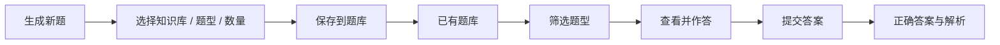
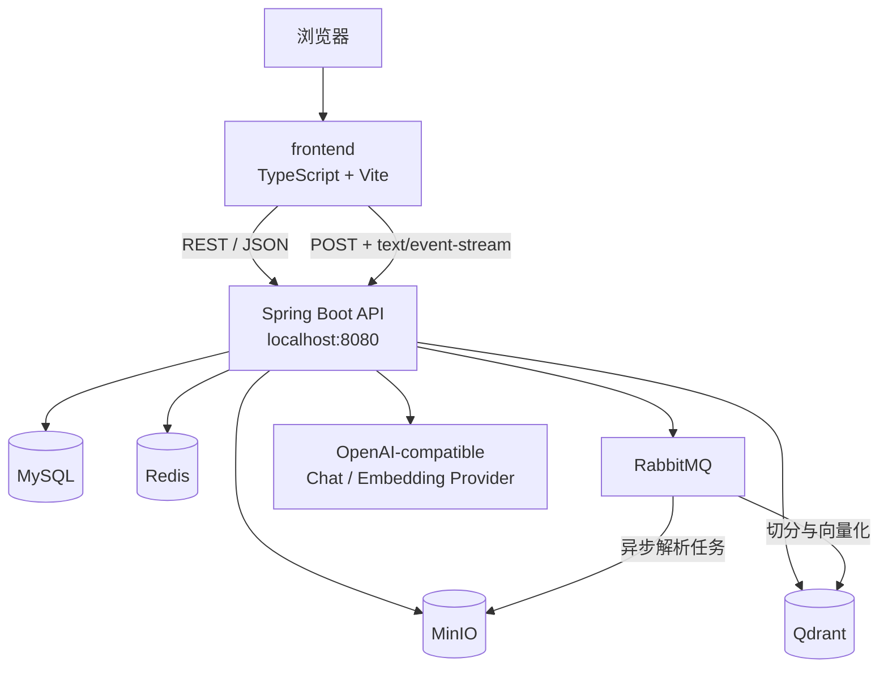
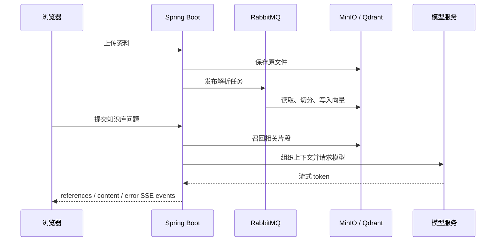

# LearnHub · AI 知识库与主动学习工作台

<p align="center">
  <strong>把零散的资料，变成真正的理解。</strong><br />
  一个面向个人学习的知识库、RAG 问答与 AI 练习平台。
</p>

<p align="center">
  <a href="https://github.com/Comui520/learnhub">GitHub</a> ·
  <a href="http://localhost:5173/">前端</a> ·
  <a href="http://localhost:8080/swagger-ui/index.html">Swagger API</a>
</p>

> LearnHub 是一个用于学习 Spring Boot、Spring AI、RAG、消息队列、缓存、对象存储和前端工程的可运行全栈项目。它强调可读、可运行、可修改，不把当前版本包装成已经完成的生产级平台。


## 项目简介

LearnHub 将“资料管理”和“知识掌握”放在同一条学习路径中：

1. 创建知识库并上传 PDF、Word、Markdown 等学习资料；
2. 后端异步解析文档、切分内容、生成向量并写入向量数据库；
3. 针对自己的资料进行 RAG 问答，回答以 SSE 流式返回，并携带引用片段；
4. 基于知识库生成单选题或多选题；
5. 在已有题库中筛选、回看和练习；
6. 提交答案后查看正确答案、解析，并记录错题；
7. 使用额度、模拟订单和限流机制控制 AI 能力的调用成本。

## 当前界面

前端已经是可运行的独立应用，位于仓库根目录的 `frontend/`：

- **总览**：查看知识库、最近活动与额度；
- **知识库**：创建、编辑、删除知识库，查看绑定资料并进入 AI 对话；
- **文档中心**：上传文件、查看解析任务、删除或重新解析文档；
- **AI 学习**：将“我的题库”和“生成新题”分成两个清晰入口；
- **题库练习**：分页查看历史题目、按题型筛选、批量选择、连续练习；
- **AI Chat**：处理正常 SSE 内容、引用事件、HTTP JSON 错误、HTTP SSE 错误和流中 `event:error`；
- **额度与订单**：查看余额、创建模拟订单、模拟支付回调；
- **个人资料**：查看当前账号和连接状态。

### AI 学习流程



## 系统架构

当前采用“模块化单体 + 独立前端”的结构：



### 文档解析与 RAG 问答



## 仓库结构

这是一个**单仓库 monorepo**。前后端位于同一个 Git 仓库、同一个 GitHub 项目中，目录边界清晰，提交记录完全可见：

```text
LearnHub/
├─ LearnHubBackend/          # Java 21 + Spring Boot 多模块后端
│  ├─ learnhub-application/  # 应用启动模块、配置、Swagger
│  ├─ learnhub-common/       # ApiResponse、异常码、公共分页
│  ├─ learnhub-user/         # 注册、登录、JWT、RBAC
│  ├─ learnhub-knowledge/    # 知识库、文件、解析任务、MinIO
│  ├─ learnhub-ai/           # RAG、Spring AI、SSE、AI 出题
│  ├─ learnhub-study/        # 题库、答题、错题、复习
│  ├─ learnhub-credit/       # 额度、订单、幂等支付回调
│  ├─ learnhub-infrastructure/# Redis、RabbitMQ、MinIO 等基础设施
│  ├─ compose.yaml           # MySQL / Redis / RabbitMQ / MinIO / Qdrant
│  └─ .env.example           # 本地环境变量模板
├─ frontend/                 # TypeScript + Vite 学习工作台
│  ├─ src/api.ts             # REST 封装与完整 SSE 解析器
│  ├─ src/main.ts            # 页面、路由状态与交互逻辑
│  ├─ src/style.css          # 暖白纸张感视觉系统
│  └─ vite.config.ts         # 5173 前端开发服务器与 8080 API 代理
├─ docs/                     # 学习记录、截图与项目文档
├─ LEARNHUB_PLAN.md          # 分阶段学习与开发计划
├─ README.md
└─ .gitignore
```

## 技术栈

### 后端

| 领域 | 技术 |
|---|---|
| 语言与构建 | Java 21、Maven 多模块 |
| Web | Spring Boot 3.5.16、Spring MVC、Bean Validation |
| 安全 | Spring Security 6、JWT、JJWT 0.13.0、RBAC |
| 数据访问 | MySQL 8.4、Flyway、MyBatis-Plus 3.5.17、MyBatis XML |
| 缓存与并发 | Redis 7.4、Redisson、登录失败计数、AI 限流 |
| 异步处理 | RabbitMQ 4.1、重试、死信与文档解析任务 |
| 文件与向量 | MinIO、Qdrant 1.14.1 |
| AI | Spring AI 1.1.8、ChatClient、Embedding、RAG |
| API 文档 | springdoc OpenAPI 2.8.17、Swagger UI |
| 可观测性 | Actuator、SLF4J、滚动日志 |

### 前端

| 领域 | 技术 |
|---|---|
| 构建 | TypeScript、Vite 8 |
| 请求 | 原生 Fetch、Vite Proxy |
| UI | 原生 DOM 渲染、CSS 视觉系统、响应式布局 |
| 流式问答 | Fetch ReadableStream + SSE 解析器 |
| 交互 | Hash 路由、表单状态、加载 / 空状态 / 错误状态 |

## 本地运行

### 1. 准备基础设施

```powershell
cd D:\LearnHub\LearnHubBackend
Copy-Item .env.example .env
# 根据本机环境修改 .env

docker compose up -d
```

基础设施包括：

- MySQL：3306
- Redis：6379
- RabbitMQ：5672，管理页面 15672
- MinIO：9000，控制台 9001
- Qdrant：6333 / 6334

### 2. 启动后端

推荐使用 IntelliJ IDEA 启动：

```text
com.github.comui520.learnhub.LearnHubApplication
```

默认地址：

- API：`http://localhost:8080`
- Swagger UI：`http://localhost:8080/swagger-ui/index.html`
- 健康检查：`http://localhost:8080/actuator/health`

也可以在后端目录执行：

```powershell
cd D:\LearnHub\LearnHubBackend
mvn -pl learnhub-application -am spring-boot:run
```

> AI 对话和 Embedding 使用 OpenAI-compatible provider。真实 API Key、JWT secret、数据库密码只放在本地 `.env` 或运行配置中，不要提交到 Git。

### 3. 启动前端

```powershell
cd D:\LearnHub\frontend
npm install
npm run dev -- --host 127.0.0.1
```

默认地址：`http://127.0.0.1:5173/`

Vite 会将 `/api`、`/v3`、`/swagger-ui`、`/actuator` 代理到后端 `8080`。

### 4. 生产构建检查

```powershell
cd D:\LearnHub\frontend
npm run build
```

## 主要 API 约定

所有普通 REST 接口使用统一响应包装：

```json
{
  "code": "COMMON_0000",
  "message": "SUCCESS",
  "httpStatus": 200,
  "data": {},
  "timestamp": "..."
}
```

Study 题库分页接口：

```http
POST /api/v1/study/question/{knowledgeBaseId}/page
Content-Type: application/json
Authorization: Bearer <JWT>
```

```json
{
  "knowledgeBaseId": 1,
  "page": 1,
  "size": 12,
  "questionType": "SINGLE_CHOICE"
}
```

AI Chat 接口：

```http
POST /api/v1/knowledge-bases/{knowledgeBaseId}/chat
Accept: text/event-stream
Content-Type: application/json
```

SSE 事件约定：

```text
event: references
data: [{"fileName":"notes.md","chunkIndex":2}]

event: content
data: 这是回答的一部分

event: error
data: {"code":"...","message":"..."}
```

前端解析器会处理：HTTP JSON 错误、HTTP SSE 错误、`event:error`、多行 `data`、换行内容、没有末尾空行的流、空响应、连接中断，并在收到错误事件后停止继续渲染。

## 测试与验证

后端由本地运行环境负责启动；前端可以独立构建和验证：

```powershell
cd D:\LearnHub\frontend
npm run build
```

手动联调建议顺序：

1. 登录测试账号；
2. 打开“知识库”，确认知识库与文档可见；
3. 打开“AI 学习”，确认历史题库加载；
4. 查看并作答一题，确认答案与解析出现；
5. 在题库中筛选单选 / 多选；
6. 进入知识库 Chat，验证引用与 SSE 错误提示；
7. 在 Swagger UI 中查看完整接口定义。

## 学习文档

后端目录中的 `docs/` 按开发阶段记录了设计、实现、测试与复盘：

- `part-01`：工程骨架、Web 基础、OpenAPI；
- `part-02`：MySQL、Flyway、注册登录、JWT、RBAC；
- `part-03`：MyBatis-Plus、MinIO、知识库与文档生命周期；
- `part-04`：RabbitMQ、异步解析、重试与死信；
- `part-05`：Spring AI、RAG、向量检索与 SSE；
- `part-06`：Redis、限流、额度、订单与幂等；
- `part-07`：Study 领域、测试、性能和部署；
- `part-08`：配置治理、缓存一致性、SSE 加固与发布整理。

## Git 结构说明

当前 Git 根目录是 `D:\LearnHub`，而不是 `D:\LearnHub\LearnHubBackend`。因此前端和后端在同一个 GitHub 项目中，同时保持独立目录和清晰提交：

```powershell
git status
git log --oneline --all --decorate
git add LearnHubBackend
git commit -m "..."
git add frontend README.md docs
git commit -m "..."
git push origin main
```

后端历史分支 `backend-history` 仍然保留，主分支是前后端一起维护的 monorepo。

## English summary

LearnHub is a full-stack learning workspace for personal knowledge bases, RAG chat, document ingestion, AI-generated quizzes, and active recall. The repository is a monorepo containing a modular Spring Boot backend under `LearnHubBackend/` and a TypeScript/Vite frontend under `frontend/`. Local infrastructure is provided by Docker Compose. The project is intended as a readable learning foundation and an extensible prototype rather than a finished production service.

See the Chinese sections above for the complete setup, API conventions, SSE event format, testing checklist, and repository workflow.

## License

No license has been declared yet. Add a `LICENSE` file before distributing the project publicly.
