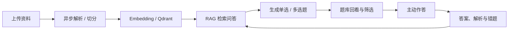
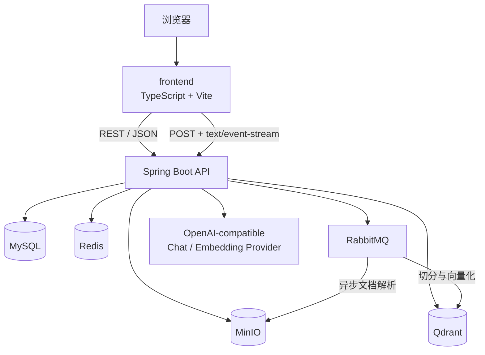

# LearnHub · AI 知识库与主动学习工作台

<p align="center">
  
</p>

<p align="center">
  <strong>把零散的资料，变成真正的理解。</strong><br />
  一个面向个人学习的知识库、RAG 问答与 AI 主动练习平台。
</p>

<p align="center">
  <a href="README_en.md">English</a> ·
  <a href="docs/README.md">从零文档</a> ·
  <a href="LICENSE">MIT License</a> ·
  <a href="https://github.com/Comui520/learnhub">GitHub</a>
</p>

<p align="center">
  <a href="https://github.com/Comui520/learnhub/stargazers"></a>
  <a href="LICENSE"></a>
  
  
  
</p>

> LearnHub 是一个**可运行、可阅读、可扩展**的全栈学习项目：你可以上传资料、建立个人知识库、通过 RAG 与资料对话，再把理解沉淀为可回看、可筛选、可练习的题库。它首先是一套从零搭建的工程学习实践，其次才是一个可继续迭代的产品原型。

## 一眼了解

| 从资料到掌握 | 从源码到系统 |
| --- | --- |
| 上传资料 → 异步解析 → 向量检索 → SSE 流式问答 → AI 生成题目 → 主动回忆与反馈 | Java 21、Spring Boot、Spring AI、MyBatis、Redis、RabbitMQ、MinIO、Qdrant、MySQL、TypeScript、Vite |

## 真实界面截图

> 以下截图来自本仓库的本地联调环境，仅用于展示界面与功能；项目当前**没有部署公共在线演示站**。请按下方“本地运行”启动自己的环境。

### 总览与知识库

<table>
  <tr>
    <td width="50%"></td>
    <td width="50%"></td>
  </tr>
  <tr>
    <td align="center"><strong>总览</strong><br />知识空间、最近活动与额度一屏掌握</td>
    <td align="center"><strong>知识库</strong><br />按主题整理资料，作为 RAG 与练习的上下文</td>
  </tr>
</table>

### AI 学习：题库、生成与练习

<table>
  <tr>
    <td width="50%"></td>
    <td width="50%"></td>
  </tr>
  <tr>
    <td align="center"><strong>已有题库</strong><br />筛选、回看、批量练习历史生成的题目</td>
    <td align="center"><strong>生成新题</strong><br />选择知识库、题型、数量和可选主题后生成</td>
  </tr>
</table>

<p align="center">
  
</p>
<p align="center"><strong>练习反馈</strong>：提交答案后查看正误、标准答案与解析。</p>

## 核心能力

- **个人知识库**：创建、编辑、删除知识库；将多个资料按主题组织起来。
- **文档生命周期**：上传 PDF、Word、Markdown、TXT 等资料；查看解析任务并管理绑定关系。
- **RAG 问答**：从私有资料中检索上下文，以 SSE 实时返回答案和引用片段。
- **SSE 加固**：前端兼容 HTTP JSON 错误、HTTP SSE 错误、`event:error`、多行 `data`、末段无空行、空响应和连接中断。
- **AI 主动学习**：已有题库与“生成新题”分为清晰入口，避免生成浮层长期占据页面。
- **题库复习**：按单选 / 多选筛选、分页回看、批量选择、连续练习、查看解析与错题记录。
- **额度与订单**：额度扣减、模拟订单、幂等支付回调与 AI 调用成本控制。
- **工程基础设施**：MySQL、Redis、RabbitMQ、MinIO、Qdrant 通过 Docker Compose 提供本地依赖。

## 学习路径：从资料到掌握



## 系统架构



## 从零开始：配套文档不是附录

**LearnHubBackend/docs/** 是本项目的重要组成部分，不是简单的接口说明。它是一套按阶段编排的“从零搭建与学习记录”，保留设计取舍、实现过程、测试要点和复盘内容；适合边读边实现，而不是只复制最终代码。

- 文档导航：[`docs/README.md`](docs/README.md)
- 后端完整学习文档：[`LearnHubBackend/docs/`](LearnHubBackend/docs/)
- 项目阶段计划：[`LEARNHUB_PLAN.md`](LEARNHUB_PLAN.md)

| 阶段 | 学习主题 | 文档入口 |
| --- | --- | --- |
| Week 01 / Part 01 | Maven、Spring Boot、MVC、统一响应、OpenAPI、Docker 基础 | [`week-01`](LearnHubBackend/docs/week-01/README.md) · [`part-01`](LearnHubBackend/docs/part-01/README.md) |
| Part 02 | MySQL、Flyway、注册登录、密码安全、JWT、RBAC、登录限制 | [`part-02`](LearnHubBackend/docs/part-02/README.md) |
| Part 03 | MyBatis-Plus、XML Mapper、MinIO、知识库与文档生命周期 | [`part-03`](LearnHubBackend/docs/part-03/README.md) |
| Part 04 | RabbitMQ、异步解析、重试、死信与恢复 | [`part-04`](LearnHubBackend/docs/part-04/README.md) |
| Part 05 | Spring AI、文档切分、Embedding、向量检索、RAG、SSE | [`part-05`](LearnHubBackend/docs/part-05/README.md) |
| Part 06 | Redis、缓存、限流、额度、订单与幂等 | [`part-06`](LearnHubBackend/docs/part-06/README.md) |
| Part 07 | Study 题库领域、测试、并发、性能、部署思路 | [`part-07`](LearnHubBackend/docs/part-07/README.md) |
| Part 08 | 配置治理、缓存一致性、SSE 加固、发布整理 | [`part-08`](LearnHubBackend/docs/part-08/README.md) |

## 仓库结构

这是一个**单仓库 monorepo**：前后端共用同一个 Git 根目录与 GitHub 项目，因而两端的完整提交历史均可见。

```text
LearnHub/
├─ LearnHubBackend/             # Java 21 + Spring Boot 多模块后端
│  ├─ learnhub-application/     # 启动模块、配置、Swagger / OpenAPI
│  ├─ learnhub-common/          # ApiResponse、异常码、公共分页
│  ├─ learnhub-user/            # 注册、登录、JWT、RBAC
│  ├─ learnhub-knowledge/       # 知识库、文件、解析任务、MinIO
│  ├─ learnhub-ai/              # RAG、Spring AI、SSE、AI 出题
│  ├─ learnhub-study/           # 题库、答题、错题、复习
│  ├─ learnhub-credit/          # 额度、订单、幂等支付回调
│  ├─ learnhub-infrastructure/  # Redis、RabbitMQ、MinIO 等基础设施
│  ├─ compose.yaml              # 本地依赖服务
│  └─ docs/                     # 从零学习与实现文档（核心）
├─ frontend/                    # TypeScript + Vite 前端工作台
│  ├─ public/                   # LearnHub Logo、favicon 等品牌资产
│  ├─ src/api.ts                # REST 封装与 SSE 解析器
│  ├─ src/main.ts               # 页面、路由状态与交互逻辑
│  └─ src/style.css             # 暖白纸张感视觉系统
├─ docs/                        # 根目录文档导航与真实界面截图
├─ README.md                    # 中文主文档
├─ README_en.md                 # English documentation
├─ LEARNHUB_PLAN.md             # 分阶段学习与开发计划
└─ LICENSE                      # MIT License
```

## 技术栈

| 层级 | 技术 |
| --- | --- |
| 语言与构建 | Java 21、Maven 多模块、TypeScript、Vite 8 |
| Web 与安全 | Spring Boot 3.5.16、Spring MVC、Bean Validation、Spring Security 6、JWT、RBAC |
| 数据访问 | MySQL 8.4、Flyway、MyBatis-Plus 3.5.17、MyBatis XML |
| 缓存与并发 | Redis 7.4、Redisson、登录失败计数、AI 限流 |
| 异步与对象存储 | RabbitMQ 4.1、重试 / 死信、MinIO |
| AI 与检索 | Spring AI 1.1.8、ChatClient、Embedding、Qdrant 1.14.1、RAG、SSE |
| API 与可观测性 | springdoc OpenAPI、Swagger UI、Actuator、SLF4J、滚动日志 |
| 前端交互 | 原生 DOM 渲染、Hash 路由、Fetch、ReadableStream、响应式 CSS |

## Docker 一键启动（推荐完整体验）

仓库根目录现在提供完整的容器化运行方案，可一次启动前端、后端、MySQL、Redis、RabbitMQ、MinIO 和 Qdrant：

```powershell
Copy-Item .env.example .env
# 编辑 .env，替换密码、JWT_SECRET 和 API_KEY
docker compose up -d --build
```

启动完成后访问：

```text
LearnHub:    http://localhost:8088
Swagger UI: http://localhost:8088/swagger-ui/index.html
Health:     http://localhost:8088/actuator/health
```

完整说明、更新、日志、数据卷和单机服务器建议见 [`docs/docker-deployment.md`](docs/docker-deployment.md)。

面试演示时，准备好根目录 `.env` 后可以直接双击 `start-demo.cmd`；它会检查 Docker、启动服务、等待健康检查通过并打开 `http://localhost:8088`。

> Docker 启动不要求宿主机安装 Java、Maven、Node.js 或数据库。项目尚未附带公网域名和 HTTPS；公开部署时应额外配置反向代理、证书、备份与 Secret 管理。

## 本地运行

> 本仓库目前没有公共部署地址。下列地址仅适用于你**在本机启动服务之后**，不是在线演示链接。

### 1. 准备基础设施

```powershell
cd D:\LearnHub\LearnHubBackend
Copy-Item .env.example .env
# 根据自己的本机环境填写 .env；不要提交真实密钥
docker compose up -d
```

依赖服务：MySQL（3306）、Redis（6379）、RabbitMQ（5672 / 管理端 15672）、MinIO（9000 / 控制台 9001）、Qdrant（6333 / 6334）。

### 2. 启动后端

推荐通过 IntelliJ IDEA 运行：

```text
com.github.comui520.learnhub.LearnHubApplication
```

或在后端目录执行：

```powershell
mvn -pl learnhub-application -am spring-boot:run
```

启动后，可在浏览器访问以下**本地**地址：

```text
API:            http://localhost:8080
Swagger UI:     http://localhost:8080/swagger-ui/index.html
Health check:   http://localhost:8080/actuator/health
```

### 3. 启动前端

```powershell
cd D:\LearnHub\frontend
npm install
npm run dev -- --host 127.0.0.1
```

前端开发地址：

```text
http://127.0.0.1:5173/
```

Vite 会把 `/api`、`/v3`、`/swagger-ui`、`/actuator` 代理到本机后端 `8080`。前端页面已使用 `frontend/public/favicon.ico`、SVG favicon 和 LearnHub Logo。

### 4. 前端生产构建检查

```powershell
cd D:\LearnHub\frontend
npm run build
```

## API 与 SSE 约定

普通 REST 接口使用统一包装：

```json
{
  "code": "COMMON_0000",
  "message": "SUCCESS",
  "httpStatus": 200,
  "data": {},
  "timestamp": "..."
}
```

AI Chat 使用 `POST` 和 `text/event-stream`，事件示例：

```text
event: references
data: [{"fileName":"notes.md","chunkIndex":2}]

event: content
data: 这是回答的一部分

event: error
data: {"code":"...","message":"..."}
```

题库分页请求示例：

```http
POST /api/v1/study/question/{knowledgeBaseId}/page
Content-Type: application/json
Authorization: Bearer <JWT>
```

```json
{
  "knowledgeBaseId": 1,
  "page": 1,
  "size": 12,
  "questionType": "SINGLE_CHOICE"
}
```

## 验证建议

1. 启动基础设施、后端和前端；
2. 注册或登录一个本地账号；
3. 创建知识库并上传资料；
4. 等待文档解析完成后，在 Chat 中确认引用和流式回答；
5. 在“AI 学习”中生成单选或多选题；
6. 回到“已有题库”，筛选、查看并提交答案；
7. 通过 Swagger UI 查看完整接口定义；
8. 执行 `npm run build`，确保前端生产构建通过。

## 开源许可

本项目使用 [MIT License](LICENSE)。MIT 是宽松许可证：在保留版权与许可声明的前提下，任何人都可以将本项目用于个人、教育、商业或其他用途，也可以使用、复制、修改、合并、发布、分发、再授权或销售其副本。

项目按“现状”提供，不附带任何明示或默示担保。详见 [`LICENSE`](LICENSE)。

---

<p align="center">
  如果这个项目对你的学习或实践有帮助，欢迎 Star、Fork、修改并用于自己的项目。<br />
  <a href="README_en.md">Read this README in English</a>
</p>
