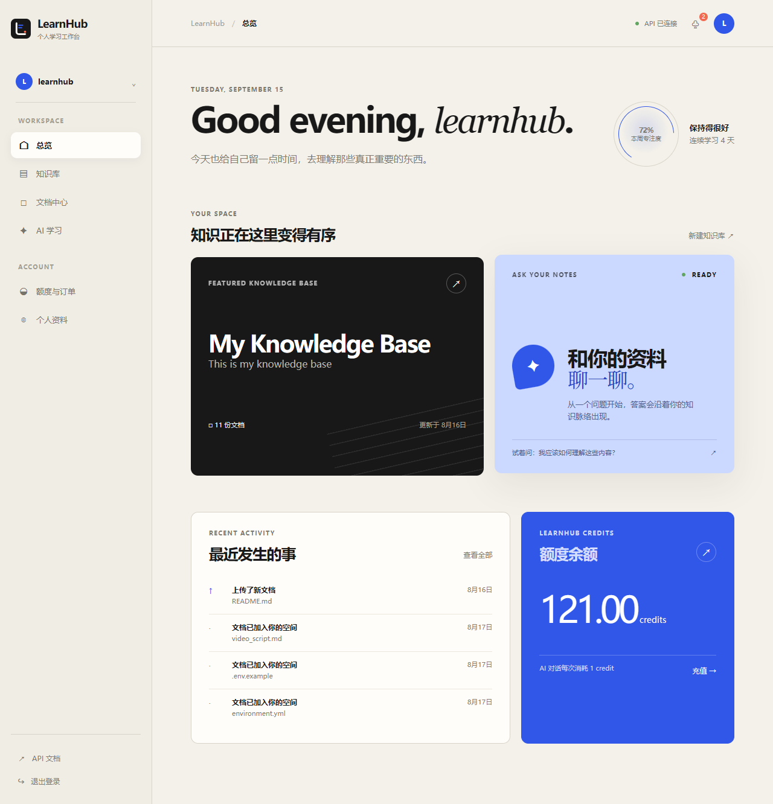
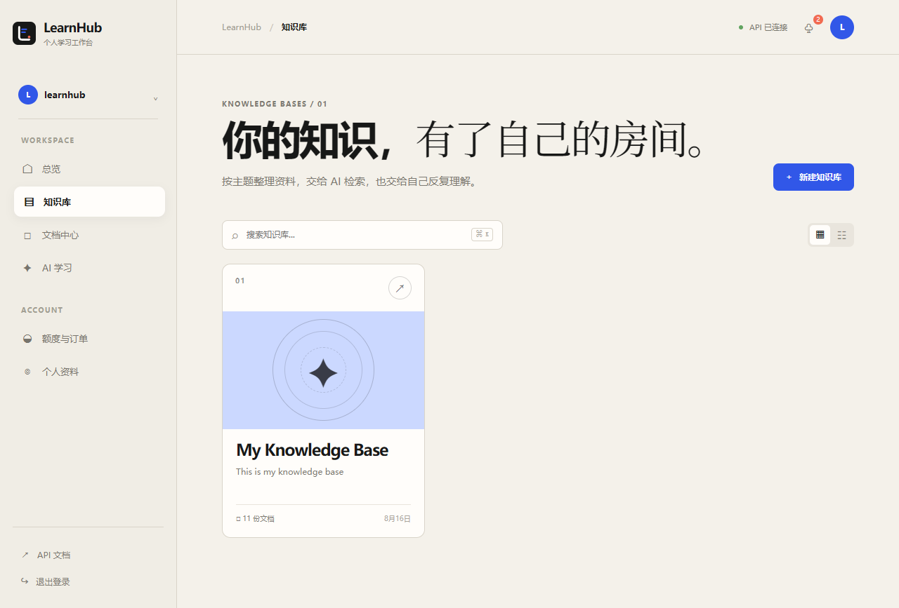
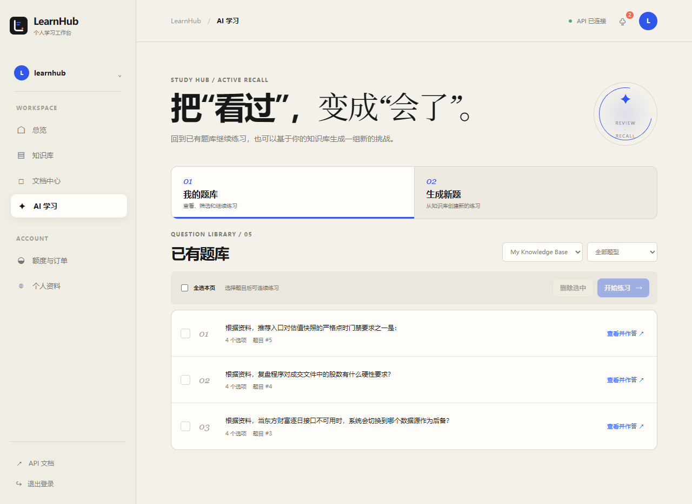
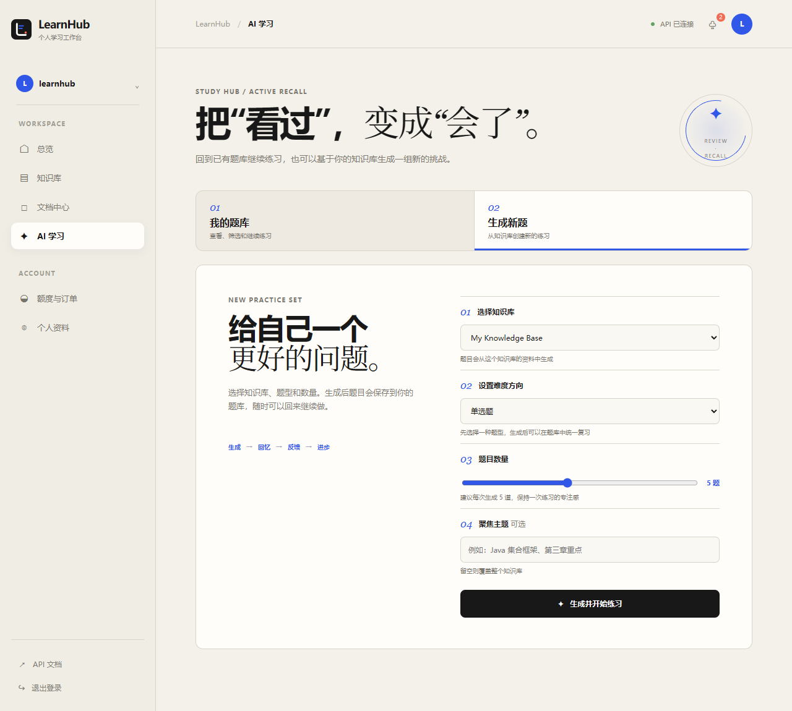
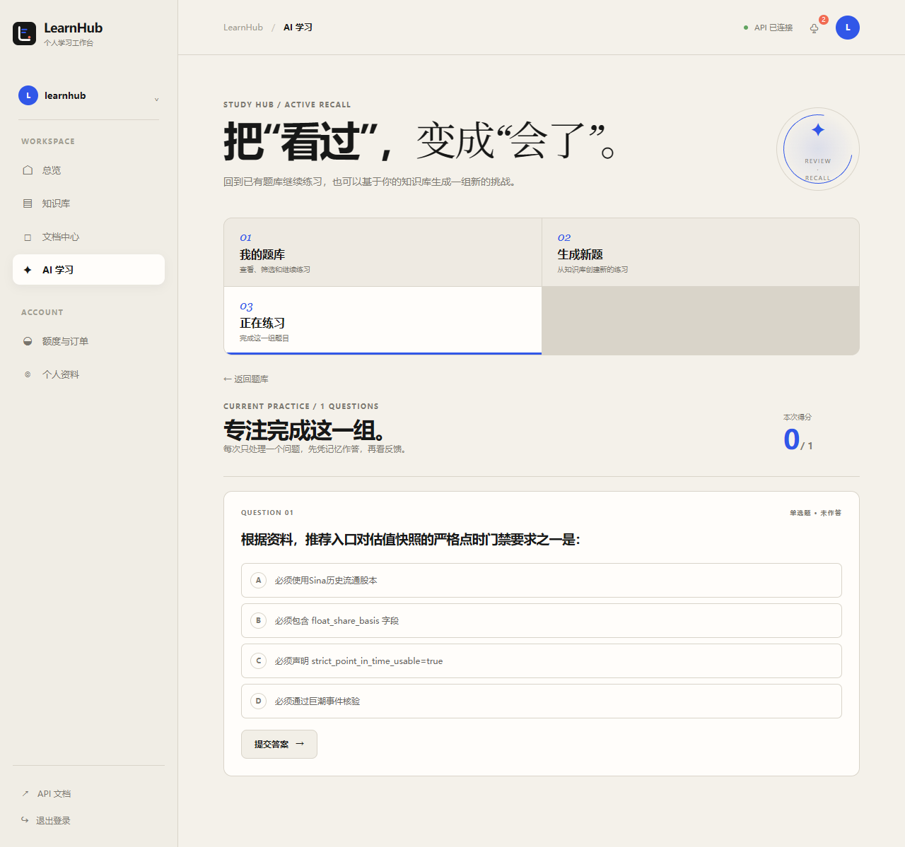
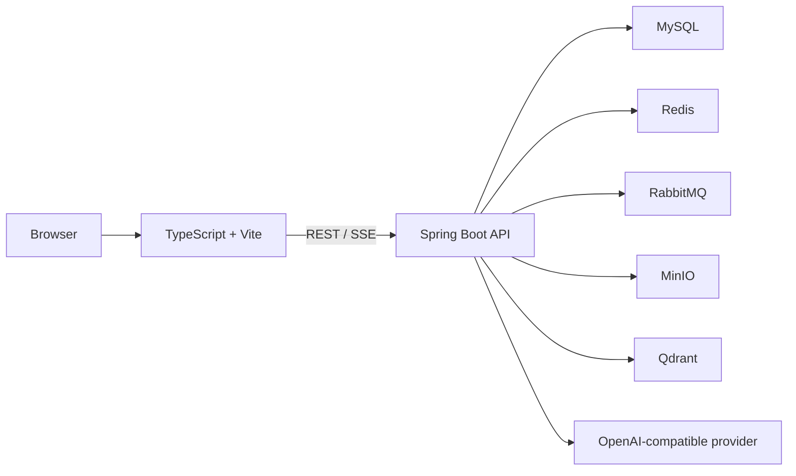

# LearnHub · AI Knowledge Base & Active Learning Workspace

<p align="center">
  
</p>

<p align="center">
  <strong>Turn scattered materials into genuine understanding.</strong><br />
  A personal learning platform for knowledge bases, RAG chat, and active-recall practice.
</p>

<p align="center">
  <a href="README.md">中文文档</a> ·
  <a href="docs/README.md">Documentation guide</a> ·
  <a href="LICENSE">MIT License</a> ·
  <a href="https://github.com/Comui520/learnhub">GitHub</a>
</p>

> LearnHub is a runnable, readable, and extensible full-stack learning project. Upload your materials, organize a personal knowledge base, ask grounded RAG questions, and transform the material into reusable AI-generated quizzes.

## Screenshots

<table>
  <tr>
    <td width="50%"></td>
    <td width="50%"></td>
  </tr>
  <tr>
    <td align="center">Overview: spaces, recent activity, and credits</td>
    <td align="center">Knowledge bases: organize source material by topic</td>
  </tr>
  <tr>
    <td></td>
    <td></td>
  </tr>
  <tr>
    <td align="center">Question library: filter, revisit, and practice saved questions</td>
    <td align="center">New questions: select a knowledge base, type, count, and focus</td>
  </tr>
</table>

<p align="center">
  
</p>

> These are real screenshots from a local integration environment. LearnHub currently has no public deployment; follow the local setup instructions below to run your own instance.

## Features

- Personal knowledge bases and document binding
- Document upload, asynchronous parsing, chunking, embeddings, and vector retrieval
- RAG chat with streamed SSE content and source references
- Robust browser-side SSE parsing: JSON/SSE HTTP errors, `event:error`, multiline data, partial final events, empty streams, and interrupted connections
- AI-generated single-choice and multiple-choice questions
- A dedicated question-library view for filtering, revisiting, batch practice, answer feedback, and review
- Credit balance, mock orders, idempotent payment callback, and AI-cost control
- Docker Compose development dependencies: MySQL, Redis, RabbitMQ, MinIO, and Qdrant

## Architecture



## Documentation: build it from the ground up

The documentation is a core deliverable of this repository, not an afterthought. [`LearnHubBackend/docs/`](LearnHubBackend/docs/) is a staged, from-scratch implementation record covering architecture decisions, setup, tests, and reviews.

Start with the root guide: [`docs/README.md`](docs/README.md).

It covers:

1. Maven, Spring Boot, MVC, API response design, OpenAPI, and Docker basics;
2. MySQL, Flyway, registration, password security, JWT, RBAC, and login limits;
3. MyBatis, MinIO, knowledge bases, and document lifecycle;
4. RabbitMQ, asynchronous parsing, retry, and dead-letter recovery;
5. Spring AI, embeddings, vector search, RAG, and SSE;
6. Redis, caching, rate limits, credits, orders, and idempotency;
7. Study-domain APIs, tests, concurrency, performance, and deployment ideas;
8. Configuration governance, cache consistency, SSE hardening, and release preparation.

## Repository layout

```text
LearnHub/
├─ LearnHubBackend/       # Java 21 + modular Spring Boot backend
│  └─ docs/               # Step-by-step learning and implementation notes
├─ frontend/              # TypeScript + Vite workspace
│  └─ public/             # LearnHub logo and favicon assets
├─ docs/                  # Documentation index and real UI screenshots
├─ README.md              # Chinese primary README
├─ README_en.md           # This English README
└─ LICENSE                # MIT License
```

## Quick start

> The following are **local development addresses**, not public links.

### 1. Start infrastructure

```powershell
cd D:\LearnHub\LearnHubBackend
Copy-Item .env.example .env
# Fill in your local settings. Never commit secrets.
docker compose up -d
```

### 2. Start the backend

Run `com.github.comui520.learnhub.LearnHubApplication` in IntelliJ IDEA, or:

```powershell
cd D:\LearnHub\LearnHubBackend
mvn -pl learnhub-application -am spring-boot:run
```

Local endpoints after startup:

```text
API:        http://localhost:8080
Swagger UI: http://localhost:8080/swagger-ui/index.html
Health:     http://localhost:8080/actuator/health
```

### 3. Start the frontend

```powershell
cd D:\LearnHub\frontend
npm install
npm run dev -- --host 127.0.0.1
```

Open locally:

```text
http://127.0.0.1:5173/
```

### 4. Build the frontend

```powershell
cd D:\LearnHub\frontend
npm run build
```

## License

LearnHub is distributed under the [MIT License](LICENSE). You may use, copy, modify, merge, publish, distribute, sublicense, and sell copies of the software for personal, educational, commercial, or other purposes, provided that the copyright and license notice are retained.

---

<p align="center"><a href="README.md">返回中文 README</a></p>
