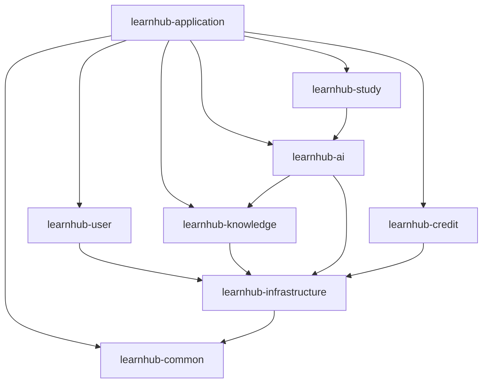

# Day 7：模块架构、完整验收与第一周复盘

## 今天的结果

把第一周成果整理成别人能运行、你能讲解的工程，并通过完整验收后再进入用户注册与登录。

预计用时：4～5 小时。

## 一、原理课：模块化单体

LearnHub 当前是一个部署单元、多个 Maven 模块：

```text
learnhub-application       组合根与启动入口
learnhub-common            稳定的跨模块公共契约
learnhub-user              用户、认证、权限
learnhub-knowledge         知识库与文档元数据
learnhub-ai                切分、向量检索、RAG 与模型调用
learnhub-study             题目、答题、错题与复习
learnhub-credit            额度、流水与模拟订单
learnhub-infrastructure    外部系统客户端和技术适配
```

模块化单体的价值：

- 保留清晰业务边界。
- 一次部署，事务和本地调用简单。
- 测试和排错成本低于早期微服务。
- 稳定后仍可按边界拆出 Worker 或 AI 服务。

它不会自动保证边界；依赖方向和代码评审仍然重要。

## 二、依赖规则

画出仓库当前真实依赖图，而不是只画计划中的理想图。可以使用 Mermaid：



根据实际依赖树修正它，并检查：

- 没有模块依赖 `learnhub-application`。
- `learnhub-common` 不依赖业务模块。
- 没有循环依赖。
- 模块没有因为方便而全部互相依赖。
- `learnhub-application` 不承载真实业务规则。

第一周依赖瘦身后，当前真实图可能比上图更简单；这完全正常。

## 三、完整验收流程

### 1. 从干净状态构建

```powershell
cd D:\LearnHub\LearnHubBackend
mvn clean verify
```

记录测试数量和 Reactor Summary。

### 2. 运行可执行 JAR

```powershell
java -jar .\learnhub-application\target\learnhub-application-0.0.1-SNAPSHOT.jar --spring.profiles.active=dev
```

验证：

```powershell
curl.exe -i http://localhost:8080/actuator/health
curl.exe -i -X POST http://localhost:8080/api/v1/demo/greetings -H "Content-Type: application/json" -d '{"name":"LearnHub"}'
```

### 3. 验证基础设施

```powershell
docker compose up -d
docker compose ps
```

### 4. 检查 Git

```powershell
git status
git log --oneline --decorate -10
```

确认没有：

- 密码和 API Key。
- `.env`。
- `target`。
- IDE 私有配置。
- 临时日志和调试文件。

## 四、完善 README

第一周结束时 README 至少包含：

1. 产品简介。
2. 当前系统结构。
3. 技术栈与版本。
4. 环境要求。
5. 构建命令。
6. 本地启动命令。
7. Docker Compose 启动方法。
8. 模块职责与依赖图。
9. Health、Swagger 地址。
10. 当前开发进度和下一阶段计划。

请让一个“没有参与开发的人”仅依赖 README 也知道如何启动。暂时无法完成的步骤要诚实标注，不要写成已完成。

## 五、主动排错考核

随机完成三项并解释：

1. 让请求参数为空，判断为什么是 400。
2. 触发业务异常，指出它如何经过全局处理器。
3. 暂时占用 8080，解释应用为何启动失败。
4. 给一个错误 JSON，指出异常发生在 Controller 前还是后。
5. 停止一个 Docker 服务，用 `ps` 和 `logs` 定位。
6. 在 IDE 删除一个 import 后重新导入 Maven，区分代码错误与 IDE 缓存问题。

恢复所有故障后再次运行完整测试。

## 六、第一周答辩题

请尽量脱离代码回答：

1. 为什么 LearnHub 先做模块化单体而不是微服务？
2. 父 POM、聚合 POM、子模块是什么关系？
3. `dependencyManagement` 和 `dependencies` 有什么区别？
4. `@SpringBootApplication` 做了哪几件关键事情？
5. Spring Boot 自动配置为什么会因一个 Starter 生效？
6. 一次请求从 Tomcat 到 Controller 大致经过什么？
7. 参数错误、业务错误和系统错误如何区分？
8. HTTP 状态码和业务错误码为什么都需要？
9. `ApiResponse<T>` 使用泛型有什么好处？
10. `@WebMvcTest` 和 `@SpringBootTest` 如何选择？
11. Docker 数据为什么不会因普通 `down` 自动丢失？
12. 如果应用启动失败，你按什么顺序阅读日志？

回答要求采用：

```text
它解决什么问题
当前项目如何使用
不用它会怎样
它可能带来什么新问题
```

## 七、第一周验收清单

- [ ] Git 仓库和 `.gitignore` 正确。
- [ ] Maven Reactor 完整构建成功。
- [ ] 可执行 JAR 启动成功。
- [ ] Health 返回 `UP`。
- [ ] 示例接口三类响应正确。
- [ ] 统一响应、错误码和异常边界明确。
- [ ] 自动化测试稳定通过。
- [ ] OpenAPI/Swagger 可访问。
- [ ] Docker Compose 五个服务正常。
- [ ] 配置中没有提交真实秘密。
- [ ] README 和真实依赖图已更新。
- [ ] 十二道答辩题能够解释至少十道。

任何一项失败，都回到对应 Day 修复，不急着进入 JWT。

## 八、复盘记录模板

在 `docs/learning/week-01-retrospective.md` 或计划文档中记录：

```markdown
# 第一周复盘

## 我完成了什么

## 最难的三个问题

## 一个值得讲的 Bug
- 现象：
- 错误假设：
- 排查过程：
- 根因：
- 修复：
- 如何防止复发：

## 我现在能解释什么

## 仍然不清楚什么

## 第二周需要调整什么
```

## 九、今日提交建议

```text
docs: complete week one setup and architecture guide
```

第一周完成后，把验收清单、十二道答辩题答案和复盘文档交给老师。通过审查后，我们进入第二周：用户、登录与权限。

